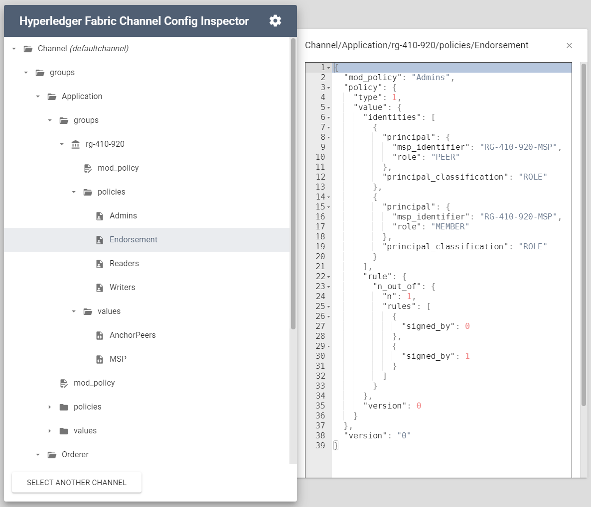

# Hyperledger Fabric Channel Config Inspector

This tool gives you a simple visual UI to inspect a Hyperledger Fabric channel config.



## Architecture

### Server

The server is a simple wrapper around Fabric tooling:

- `discovery` to find suitable nodes
- `peer` to run command and interact with the ledger
- `configtxlator` to parse the config protobuf

### Client

The client a VueJS app, which uses local storage to keep connection profile and identity.

## Usage

Simply build and run the docker image:

```
docker build -t hlf-config-inspector .
docker run --rm -t -p 4000:4000 hlf-config-inspector
```

Then go to http://localhost:4000 and provide a [connection profile](https://hyperledger-fabric.readthedocs.io/en/release-2.2/developapps/connectionprofile.html#connection-profile), as well as an identity.

The MSP ID of the identity _must_ match one of the organization in the connection profile.

The app will use these info to get the channel you can access and load it.

## Security

The identity certificates are stored locally in the browser, but are also send to the server over the network (in plaintext). Therefore, you should always run this app locally, or add the necessary tools to secure the connection to the server if needed.
